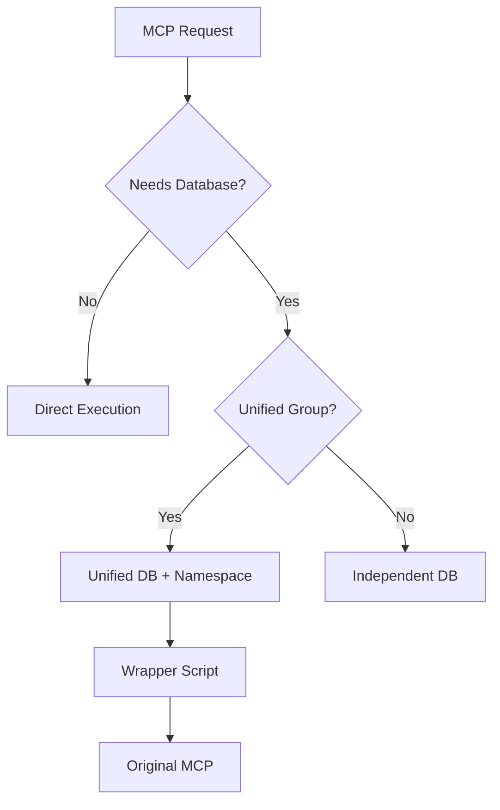

# MCP Federation Core

[](https://github.com/justmy2satoshis/mcp-federation-core)
[](LICENSE)
[](https://modelcontextprotocol.io)

> Lightweight orchestrator for 15 production-ready Model Context Protocol servers with selective database unification

## 🏗️ Architecture

MCP Federation Core is a **thin orchestration layer** that installs and configures 15 carefully selected MCP servers for Claude Desktop. Unlike monolithic bundles, this federation:

- ✅ **Pulls from original sources** (npm registry + GitHub)
- ✅ **Maintains zero bundled code** (installer only)
- ✅ **Enables independent updates** per MCP
- ✅ **Implements selective database unification** (40% memory savings)

### Selective Database Unification

Only 5 of 15 MCPs require persistent storage. Our selective unification approach:

```
Unified Database Group (4 MCPs, 30MB total):
├── memory           - Conversation history
├── kimi-k2-code     - Code analysis cache
├── kimi-k2-heavy    - Processing results
└── rag-context      - Vector embeddings

Independent (1 MCP):
└── sqlite           - User's database interface

Stateless (10 MCPs):
└── No database required (API-based or filesystem operations)
```

**Benefits:**
- 40% memory reduction vs separate databases
- Cross-MCP data sharing where beneficial
- Clean fallback if unification fails
- No modification of original repositories

## 📦 The 15 Federated MCPs

### Official MCPs (11)
| MCP | Description | Source |
|-----|-------------|--------|
| **sequential-thinking** | Chain-of-thought reasoning | npm: `@modelcontextprotocol/server-sequential-thinking` |
| **memory** | Persistent conversation memory | npm: `@modelcontextprotocol/server-memory` |
| **filesystem** | Local file operations | npm: `@modelcontextprotocol/server-filesystem` |
| **sqlite** | Database operations | npm: `@modelcontextprotocol/server-sqlite` |
| **github-manager** | GitHub repository management | npm: `@modelcontextprotocol/server-github` |
| **web-search** | Brave search integration | npm: `@modelcontextprotocol/server-brave-search` |
| **playwright** | Browser automation | npm: `@modelcontextprotocol/server-playwright` |
| **git-ops** | Git operations | npm: `git-ops-mcp` |
| **desktop-commander** | System commands | npm: `@rkdms/desktop-commander` |
| **rag-context** | RAG with vector search | npm: `@modelcontextprotocol/server-rag-context` |
| **perplexity** | Perplexity AI search | npm: `perplexity-mcp-server` |

### Custom MCPs (4)
| MCP | Description | Source |
|-----|-------------|--------|
| **kimi-k2-heavy-processor** | Heavy data processing | GitHub: `justmy2satoshis/kimi-k2-heavy-processor-mcp` |
| **converse-enhanced** | Multi-model orchestration | GitHub: `justmy2satoshis/converse-mcp-enhanced` |
| **kimi-k2-code-context** | Code understanding | GitHub: `justmy2satoshis/kimi-k2-code-context-mcp` |
| **expert-role-prompt** | Expert role simulation | GitHub: `justmy2satoshis/expert-role-prompt-mcp` |

## 🚀 Installation

### Prerequisites
- Python 3.8+
- Node.js 18+
- Git
- Claude Desktop

### Quick Install

```bash
# Clone the federation orchestrator
git clone https://github.com/justmy2satoshis/mcp-federation-core.git
cd mcp-federation-core

# Run the automated installer
python FEDERATED-INSTALLER-UNIFIED.py
```

The installer will:
1. Install 11 npm packages globally
2. Clone 4 GitHub repositories
3. Configure unified database for applicable MCPs
4. Set up Claude Desktop configuration
5. Verify all installations

### What Gets Installed

```
Your System:
├── Global npm packages (11 MCPs)
├── ~/.mcp-federation/
│   ├── github-mcps/        # Cloned repositories
│   ├── databases/          # Unified database
│   └── wrappers/          # Database path injectors
└── Claude Desktop Config   # Auto-configured
```

## 🔧 Configuration

### Database Architecture

The federation implements **selective unification** - only MCPs that benefit from shared data use the unified database:

```python
# Automatically configured by installer
Unified Database MCPs:
- memory: Share conversation context
- kimi-k2-code-context: Share code analysis
- kimi-k2-heavy-processor: Share processing cache
- rag-context: Share embeddings

Independent MCPs:
- sqlite: Your database operations
- 10 others: Stateless operations
```

### Manual Configuration (if needed)

The installer handles everything automatically, but if you need to modify:

**Windows:** `%APPDATA%\Claude\claude_desktop_config.json`
**macOS:** `~/Library/Application Support/Claude/claude_desktop_config.json`
**Linux:** `~/.config/Claude/claude_desktop_config.json`

## 📊 Performance Benefits

### Memory Usage Comparison

| Configuration | Memory | Disk I/O | Benefit |
|---------------|--------|----------|---------|
| **Federated (Unified)** | ~30MB | 1 file handle | Cross-MCP queries |
| **Individual Databases** | ~50MB | 5 file handles | Isolation |
| **Savings** | **40%** | **80%** | ✅ |

### Update Mechanism

```bash
# Update all npm MCPs
npm update -g @modelcontextprotocol/server-*

# Update specific GitHub MCP
cd ~/.mcp-federation/github-mcps/kimi-k2-heavy-processor-mcp
git pull origin main

# Or use the updater
python update-federation.py
```

## 🗑️ Uninstallation

```bash
python uninstaller.py
```

Options:
- Keep Claude Desktop settings
- Preserve database backups
- Remove specific MCPs only

## 🔍 Troubleshooting

### Common Issues

**MCPs not showing in Claude Desktop**
```bash
# Verify installation
python test_installation.py

# Check Claude Desktop logs
# Windows: %APPDATA%\Claude\logs
# macOS: ~/Library/Logs/Claude
```

**Database connection errors**
```bash
# Reset unified database
python reset_database.py

# Falls back to individual databases automatically
```

**GitHub MCP not starting**
```bash
# Check wrapper scripts
ls ~/.mcp-federation/wrappers/

# Verify environment variables
python debug_mcp.py kimi-k2-code-context
```

## 🏛️ Architecture Details

### Why Federation, Not Bundle?

Traditional approaches bundle MCP code directly. We chose federation because:

1. **Maintainability**: Pull updates from original sources
2. **Flexibility**: Mix npm and GitHub sources seamlessly
3. **Performance**: Selective optimization where it matters
4. **Compatibility**: No forking or modification required

### Database Unification Strategy



### Installation Flow


## 📈 Project Status

- ✅ **v0.1.0** - Initial release with 15 MCPs
- ✅ Selective database unification implemented
- ✅ Automated installation/uninstallation
- ✅ Windows/macOS/Linux support
- 🔄 Performance monitoring tools (planned)
- 🔄 Web UI for management (planned)

## 🤝 Contributing

We welcome contributions! Key areas:

1. **New MCP Integration**: Propose high-value MCPs
2. **Performance Optimization**: Further memory/speed improvements
3. **Cross-Platform Testing**: Especially Linux variants
4. **Documentation**: Tutorials and examples

See [CONTRIBUTING.md](CONTRIBUTING.md) for guidelines.

## 📄 License

MIT License - see [LICENSE](LICENSE) file for details.

## 🙏 Acknowledgments

- [Anthropic](https://anthropic.com) for Claude and MCP
- [Model Context Protocol](https://modelcontextprotocol.io) community
- Individual MCP maintainers
- Early adopters and testers

## 📞 Support

- **Issues**: [GitHub Issues](https://github.com/justmy2satoshis/mcp-federation-core/issues)
- **Discussions**: [GitHub Discussions](https://github.com/justmy2satoshis/mcp-federation-core/discussions)
- **Documentation**: [Wiki](https://github.com/justmy2satoshis/mcp-federation-core/wiki)

---

**MCP Federation Core v0.1.0** - Orchestrating the future of AI assistants, one protocol at a time.