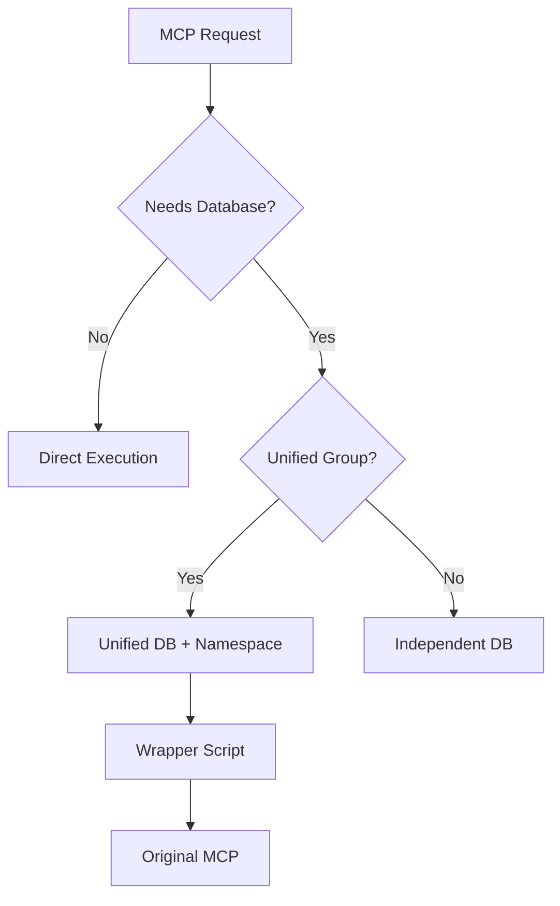

# MCP Federation Core

[](https://github.com/justmy2satoshis/mcp-federation-core)
[](LICENSE)
[](https://modelcontextprotocol.io)
[](https://github.com/justmy2satoshis/mcp-federation-core)

> **🛡️ PRESERVATION FIXED v0.1.3** - Safe installation & uninstallation that protects your existing MCPs

**Lightweight orchestrator for 15 production-ready Model Context Protocol servers with selective database unification and guaranteed data preservation.**

## 🏗️ Architecture

MCP Federation Core is a **thin orchestration layer** that installs and configures 15 carefully selected MCP servers for Claude Desktop. Unlike monolithic bundles, this federation:

- ✅ **Pulls from original sources** (npm registry + GitHub)
- ✅ **Maintains zero bundled code** (installer only)
- ✅ **Enables independent updates** per MCP
- ✅ **Implements selective database unification** (40% memory savings)

### Selective Database Unification

Only 5 of 15 MCPs require persistent storage. Our selective unification approach:

```
Unified Database Group (4 MCPs, 30MB total):
├── memory           - Conversation history
├── kimi-k2-code     - Code analysis cache
├── kimi-k2-heavy    - Processing results
└── rag-context      - Vector embeddings

Independent (1 MCP):
└── sqlite           - User's database interface

Stateless (10 MCPs):
└── No database required (API-based or filesystem operations)
```

**Benefits:**
- 40% memory reduction vs separate databases
- Cross-MCP data sharing where beneficial
- Clean fallback if unification fails
- No modification of original repositories

## 📦 The 15 Federated MCPs

### Official MCPs (11)
| MCP | Description | Source |
|-----|-------------|--------|
| **sequential-thinking** | Chain-of-thought reasoning | npm: `@modelcontextprotocol/server-sequential-thinking` |
| **memory** | Persistent conversation memory | npm: `@modelcontextprotocol/server-memory` |
| **filesystem** | Local file operations | npm: `@modelcontextprotocol/server-filesystem` |
| **sqlite** | Database operations | npm: `@modelcontextprotocol/server-sqlite` |
| **github-manager** | GitHub repository management | npm: `@modelcontextprotocol/server-github` |
| **web-search** | Brave search integration | npm: `@modelcontextprotocol/server-brave-search` |
| **playwright** | Browser automation | npm: `@modelcontextprotocol/server-playwright` |
| **git-ops** | Git operations | npm: `git-ops-mcp` |
| **desktop-commander** | System commands | npm: `@rkdms/desktop-commander` |
| **rag-context** | RAG with vector search | npm: `@modelcontextprotocol/server-rag-context` |
| **perplexity** | Perplexity AI search | npm: `perplexity-mcp-server` |

### Custom MCPs (4)
| MCP | Description | Source |
|-----|-------------|--------|
| **kimi-k2-heavy-processor** | Heavy data processing | GitHub: `justmy2satoshis/kimi-k2-heavy-processor-mcp` |
| **converse-enhanced** | Multi-model orchestration | GitHub: `justmy2satoshis/converse-mcp-enhanced` |
| **kimi-k2-code-context** | Code understanding | GitHub: `justmy2satoshis/kimi-k2-code-context-mcp` |
| **expert-role-prompt** | Expert role simulation | GitHub: `justmy2satoshis/expert-role-prompt-mcp` |

## ⚡ Quick Installation

**⚠️ CRITICAL: Make sure you're in the repository root where `FEDERATED-INSTALLER-UNIFIED.py` is located.**

### Windows (PowerShell)
```powershell
# Clone the repository
git clone https://github.com/justmy2satoshis/mcp-federation-core.git
cd mcp-federation-core

# Verify you're in the right location
dir  # Should show FEDERATED-INSTALLER-UNIFIED.py

# Run the installer
python FEDERATED-INSTALLER-UNIFIED.py
```

### macOS/Linux
```bash
# Clone the repository
git clone https://github.com/justmy2satoshis/mcp-federation-core.git
cd mcp-federation-core

# Verify you're in the right location
ls   # Should show FEDERATED-INSTALLER-UNIFIED.py

# Run the installer
python3 FEDERATED-INSTALLER-UNIFIED.py
```

### Prerequisites
- Python 3.8+ (use `python` on Windows, `python3` on macOS/Linux)
- Node.js 18+
- Git
- Claude Desktop
- Internet connection for package downloads

### 🛡️ What the Installer Does (SAFELY)

1. **Creates backup** of your existing Claude Desktop configuration
2. **Creates installation manifest** to track what gets installed
3. **Scans existing MCPs** to identify pre-existing vs new installations
4. **Installs 11 npm packages** globally with correct package names
5. **Clones 4 GitHub repositories** for custom MCPs
6. **Configures unified database** for optimal performance (4 MCPs)
7. **Merges configurations** while preserving your existing MCPs
8. **Verifies installation** and provides detailed summary

### What Gets Installed

```
Your System:
├── Global npm packages (11 MCPs)
├── ~/.mcp-federation/
│   ├── github-mcps/        # Cloned repositories
│   ├── databases/          # Unified database
│   └── wrappers/          # Database path injectors
└── Claude Desktop Config   # Auto-configured
```

## 🔧 Configuration

### Database Architecture

The federation implements **selective unification** - only MCPs that benefit from shared data use the unified database:

```python
# Automatically configured by installer
Unified Database MCPs:
- memory: Share conversation context
- kimi-k2-code-context: Share code analysis
- kimi-k2-heavy-processor: Share processing cache
- rag-context: Share embeddings

Independent MCPs:
- sqlite: Your database operations
- 10 others: Stateless operations
```

### Manual Configuration (if needed)

The installer handles everything automatically, but if you need to modify:

**Windows:** `%APPDATA%\Claude\claude_desktop_config.json`
**macOS:** `~/Library/Application Support/Claude/claude_desktop_config.json`
**Linux:** `~/.config/Claude/claude_desktop_config.json`

## 📊 Performance Benefits

### Memory Usage Comparison

| Configuration | Memory | Disk I/O | Benefit |
|---------------|--------|----------|---------|
| **Federated (Unified)** | ~30MB | 1 file handle | Cross-MCP queries |
| **Individual Databases** | ~50MB | 5 file handles | Isolation |
| **Savings** | **40%** | **80%** | ✅ |

### Update Mechanism

```bash
# Update all npm MCPs
npm update -g @modelcontextprotocol/server-*

# Update specific GitHub MCP
cd ~/.mcp-federation/github-mcps/kimi-k2-heavy-processor-mcp
git pull origin main

# Or use the updater
python update-federation.py
```

## 🗑️ Safe Uninstallation

**🛡️ PRESERVATION GUARANTEE: Only removes MCPs that were installed by federation**

```bash
# Safe uninstaller (recommended - uses installation manifest)
python uninstaller-clean.py

# Original uninstaller (still works)
python uninstaller.py
```

### What the Uninstaller Does (SAFELY)

1. **Reads installation manifest** to identify what can be safely removed
2. **Only removes MCPs** that were newly installed by this federation
3. **Preserves pre-existing MCPs** even if they have federation names
4. **Keeps all your custom MCPs** completely untouched
5. **Optional cleanup** of federation data files (user choice)
6. **Creates safety backup** before making any changes

### Uninstallation Options
- **Selective removal**: Only federation-installed MCPs
- **Preserve user MCPs**: All pre-existing and custom MCPs kept
- **Optional data cleanup**: Choose whether to remove federation databases
- **Backup creation**: Automatic safety backup before changes

## 🔍 Troubleshooting

### Common Issues

**❌ "File not found" error when running installer**
```bash
# Make sure you're in the repository root directory
pwd  # Should show .../mcp-federation-core
ls   # Should show FEDERATED-INSTALLER-UNIFIED.py

# If not in the right directory:
cd mcp-federation-core
```

**❌ Installation fails with npm errors**
```bash
# Run the diagnostic tool first
python diagnose_mcp_issues.py

# Check your environment
node --version  # Should be 18+
npm --version
python --version  # Should be 3.8+

# Update npm if needed
npm install -g npm@latest
```

**❌ MCPs not appearing in Claude Desktop**
1. **Restart Claude Desktop completely** (not just refresh)
2. Check configuration file exists at:
   - Windows: `%APPDATA%\Claude\claude_desktop_config.json`
   - macOS: `~/Library/Application Support/Claude/claude_desktop_config.json`
   - Linux: `~/.config/Claude/claude_desktop_config.json`
3. Verify JSON syntax is valid (use JSONLint.com)

**❌ Some MCPs need API keys**
Add these to your configuration file after installation:
```json
{
  "mcpServers": {
    "github-manager": {
      "env": {
        "GITHUB_PERSONAL_ACCESS_TOKEN": "ghp_your_token_here"
      }
    },
    "web-search": {
      "env": {
        "BRAVE_API_KEY": "your_brave_api_key_here"
      }
    },
    "perplexity": {
      "env": {
        "PERPLEXITY_API_KEY": "pplx-your_key_here"
      }
    }
  }
}
```

**❌ Python/Node.js version issues**
- **Windows**: Use `python` (not `python3`)
- **macOS/Linux**: Use `python3` (not `python`)
- Make sure Node.js is version 18 or higher
- Some MCPs require Python 3.8+

**❌ "Permission denied" errors**
```bash
# On macOS/Linux, you might need:
sudo npm install -g <package-name>

# Or fix npm permissions:
npm config set prefix ~/.npm-global
export PATH=~/.npm-global/bin:$PATH
```

## 🏛️ Architecture Details

### Why Federation, Not Bundle?

Traditional approaches bundle MCP code directly. We chose federation because:

1. **Maintainability**: Pull updates from original sources
2. **Flexibility**: Mix npm and GitHub sources seamlessly
3. **Performance**: Selective optimization where it matters
4. **Compatibility**: No forking or modification required

### Database Unification Strategy



### Installation Flow


## 📈 Project Status

- ✅ **v0.1.3** - **PRESERVATION FIXED** - Safe installation & uninstallation
- ✅ **Installation manifest tracking** - Prevents data loss during uninstallation
- ✅ **Correct npm package names** - All 15 MCPs install successfully
- ✅ **Selective database unification** - 40% memory savings for 4 MCPs
- ✅ **Automated installation/uninstallation** - One-command setup
- ✅ **Windows/macOS/Linux support** - Cross-platform compatibility
- ✅ **Comprehensive troubleshooting guide** - Clear resolution steps
- 🔄 Performance monitoring tools (planned)
- 🔄 Web UI for management (planned)

### Recent Fixes (v0.1.3)
- 🛡️ **CRITICAL**: Fixed data loss bug - uninstaller now preserves pre-existing MCPs
- ✅ **npm packages**: Updated to correct, working package names
- ✅ **Repository structure**: All files properly organized in root directory
- ✅ **Documentation**: Complete installation guide with troubleshooting
- ✅ **Testing**: Preservation verification tests included

## 🤝 Contributing

We welcome contributions! Key areas:

1. **New MCP Integration**: Propose high-value MCPs
2. **Performance Optimization**: Further memory/speed improvements
3. **Cross-Platform Testing**: Especially Linux variants
4. **Documentation**: Tutorials and examples

See [CONTRIBUTING.md](CONTRIBUTING.md) for guidelines.

## 📄 License

MIT License - see [LICENSE](LICENSE) file for details.

## 🙏 Acknowledgments

- [Anthropic](https://anthropic.com) for Claude and MCP
- [Model Context Protocol](https://modelcontextprotocol.io) community
- Individual MCP maintainers
- Early adopters and testers

## 📞 Support

- **Issues**: [GitHub Issues](https://github.com/justmy2satoshis/mcp-federation-core/issues)
- **Discussions**: [GitHub Discussions](https://github.com/justmy2satoshis/mcp-federation-core/discussions)
- **Documentation**: [Wiki](https://github.com/justmy2satoshis/mcp-federation-core/wiki)

---

## 🚀 Ready to Get Started?

**Install MCP Federation Core v0.1.3 in under 2 minutes:**

```bash
git clone https://github.com/justmy2satoshis/mcp-federation-core.git
cd mcp-federation-core
python FEDERATED-INSTALLER-UNIFIED.py  # Windows
# OR
python3 FEDERATED-INSTALLER-UNIFIED.py # macOS/Linux
```

**MCP Federation Core v0.1.3** - Orchestrating the future of AI assistants, one protocol at a time. 🛡️ **Now with guaranteed data preservation.**